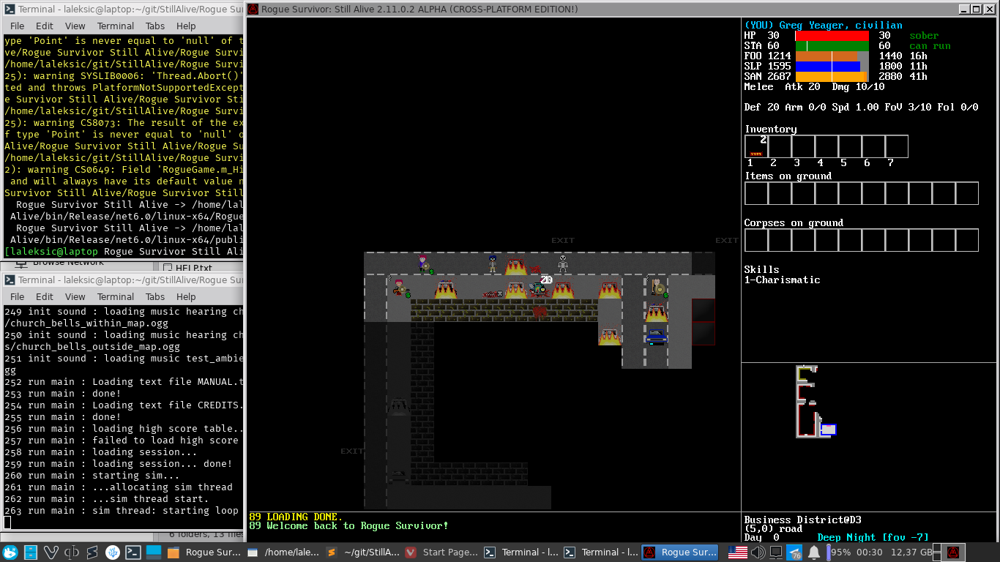

# Still Alive readme

Rogue Survivor is a free zombie survival roguelike sandbox game with unique features.
The game takes place in a town famous for being the headquarters of the powerful CHAR Corporation. You find yourself amidst the outbreak of chaos and you must find a way to survive. 

Rogue Survivor 'Staying Alive' is a fork of the vanilla Rogue Survivor Alpha 10.1 source code from 2018, released as open source under GNU GPL v3.

If you wish to use or share this code in any way please first read \Rogue Survivor Still Alive\README.txt


Discussion of this fork is taking place here: http://roguesurvivor.proboards.com/thread/377

The Config tool (RSConfig) that accompanies the game is here: https://gitlab.com/RogueSurvivor-StillAlive/RSConfig

The website for the original game is here: http://roguesurvivor.blogspot.com/

Feel free to add to the Issues board. If you would like to contribute code please contact the owner, Mark (aka MP), via the RS forum http://roguesurvivor.proboards.com (yes, you will need to create an account) or the RS Discord (link available from the forum).

## Cross-platform edition notes

This is a set of modifications to Still Alive that port it to .NET 6 and remove all dependencies on Windows specific stuff such as GDI, DirectX and WinForms. I tested compiling and short gameplay sessions on Windows 7 and Manjaro Linux. No reason why it wouldn't also work on a mac, but I have no macs to test it on. I haven't tested proper, longer gameplay sessions yet, so it's probably still buggy and unstable.

Still Alive already has a sound system based on SFML, so I also used SFML to provide the window, graphics and input handling as well. Unlike Still Alive, I don't bundle SFML, but rather I reference a NuGet package. The version has also been bumped to 2.5.1.

RSConfig, the separate configuration program for Still Alive, was also made obsolete, as I integrated relevant settings from it into the in-game options menu.

I also removed some unused code autogenerated by an IDE or some such, and cleaned up the build system a little.

The font used in game is different from Still Alive because SFML doesn't have access to system installed fonts, and I'm not sure it would be legal to bundle the font Still Alive uses, so I went with a nice retro pixel font instead.

### Screenshots




### Building

To build the Cross-platform edition, you need the .NET 6.0 SDK (get it here: https://dotnet.microsoft.com/en-us/download).

Go to the folder containing `Rogue Survivor Still Alive.csproj` in your terminal, and to build for 64-bit Windows 7 run the following command:

```
dotnet build -c Release -r win7-x64 --self-contained

```

and you'll get a nice little bundle you can run and distribute inside the subfolder `bin\Release\net6.0\win7-x64\`. It includes all dependencies so players don't have to worry about having the right version of the .NET runtime installed or anything like that.

To build for 64-bit Linux, replace `win7-x64` above with `linux-x64`. For other platforms, see: https://learn.microsoft.com/en-us/dotnet/core/rid-catalog

That's it. Enjoy.

### Pre-built executables

You can also download executables built by me for 64-bit Windows 7 and 64-bit Linux. See the releases section. 
Here's hoping they work on your machine as well. 

Cheers,
Luka